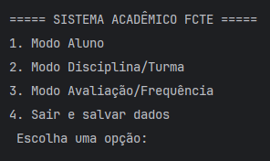
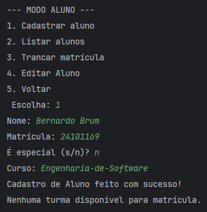
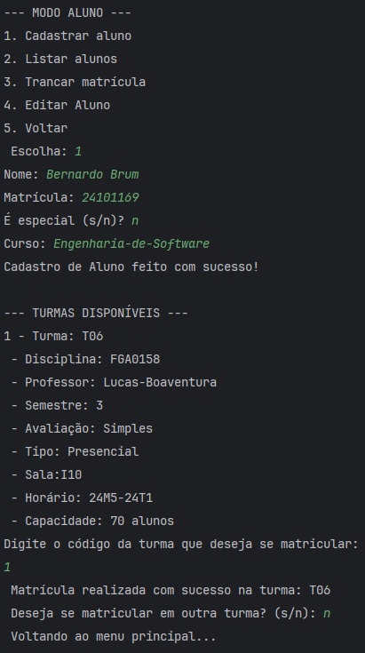
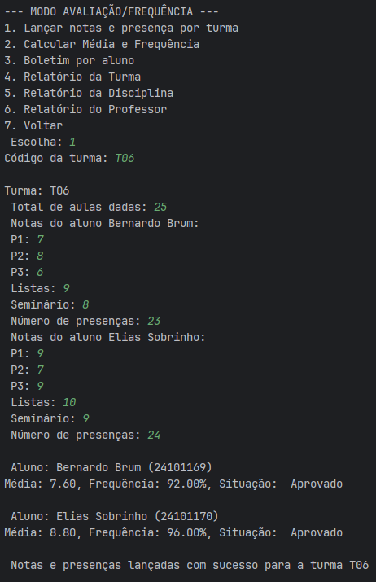
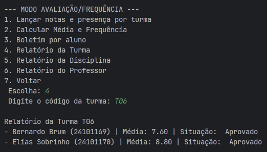

# Sistema Acadêmico - FCTE

## Descrição do Projeto

Desenvolvimento de um sistema acadêmico para gerenciar alunos, disciplinas, professores, turmas, avaliações e frequência, utilizando os conceitos de orientação a objetos (herança, polimorfismo e encapsulamento) e persistência de dados em arquivos.

O enunciado do trabalho pode ser encontrado aqui:
- [Trabalho 1 - Sistema Acadêmico](https://github.com/lboaventura25/OO-T06_2025.1_UnB_FCTE/blob/main/trabalhos/ep1/README.md)

## Dados do Aluno

- **Nome completo:** Nicolai Bukvar Miketen
- **Matrícula:** 241025345
- **Curso:** Engenharias (3 Semestre)
- **Turma:** T06

---

## Instruções para Compilação e Execução

1. **Compilação:**  
   [Descrever aqui como compilar o projeto. Exemplo: `javac Main.java` ou o script usado]

   2. **Execução:**  
      [Descrever aqui como executar o projeto. Exemplo: `java Main` ou o script usado]

   3. **Estrutura de Pastas:**  
   sistema-fcte/  
   ├── .idea/  
   ├── out/  
   ├── Prints-Fucionamento/                    
   │     
   ├── src/                     
   │   ├── acao/   
   │   │   ├── AcaoAluno.java   
   │   │   ├── AcaoAvalicaoFrequencia.java  
   │   │   └── AcaoDisciplinaTurma.java  
   │   ├── main/  
   │   │   └── SistemaAcademico.java   
   │   ├── modelo/  
   │   │   ├── Aluno.java  
   │   │   ├── AlunoEspecial.java  
   │   │   ├── Avaliacao.java  
   │   │   ├── AvaliacaoPonderada.java  
   │   │   ├── AvaliacaoSimples.java  
   │   │   ├── Disciplina.java  
   │   │   ├── Professor.java  
   │   │   ├── ResultadoFinal.java  
   │   │   └──Turma.java  
   │   │     
   │   └── persistencia/   
   │       ├── PersistenciaAluno.java  
   │       ├── PersistenciaDisciplina.java  
   │       ├── PersistenciaProfessor.java  
   │       └──PersistenciaTurma.java  
   │   
   ├── .gitgnore                  
   ├── alunos.csv        
   ├── disciplinas.csv              
   ├── professores.csv  
   ├── README.md  
   ├──sistema-fcte.iml  
   └──turmas.csv  
   
3. **Versão do JAVA utilizada:**  
Oracle OpenJDK 24.0.1

---

## Vídeo de Demonstração

- [Inserir o link para o vídeo no YouTube/Drive aqui]

---

## Prints da Execução

### 1. Menu Principal: 
   

### 2. Cadastro de Aluno:
   

   

### 3. Relatório de Frequência/Notas: 
   

   

## Principais Funcionalidades Implementadas

- [x] Cadastro, listagem, matrícula e trancamento de alunos (Normais e Especiais)
- [X] Cadastro de disciplinas e criação de turmas (presenciais e remotas)
- [X] Matrícula de alunos em turmas, respeitando vagas e pré-requisitos
- [X] Lançamento de notas e controle de presença
- [X] Cálculo de média final e verificação de aprovação/reprovação
- [X] Relatórios de desempenho acadêmico por aluno, turma e disciplina
- [X] Persistência de dados em arquivos (.txt ou .csv)
- [X] Tratamento de duplicidade de matrículas
- [X] Uso de herança, polimorfismo e encapsulamento

---

## Observações (Extras ou Dificuldades)

- [Espaço para o aluno comentar qualquer funcionalidade extra que implementou, dificuldades enfrentadas, ou considerações importantes.]

---

## Contato

- [Opcional: E-mail pessoal do aluno.]
